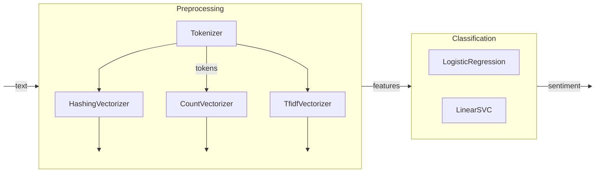

# Sentiment Analysis [](https://huggingface.co/spaces/Tymec/sentiment-analysis)


### Table of Contents
- [Description](#description)
- [Installation](#installation)
  - [Prerequisites](#prerequisites)
- [Usage](#usage)
  - [Predict](#predict)
  - [GUI](#gui)
  - [Training](#training)
  - [Evaluation](#evaluation)
- [Options](#options)
  - [Datasets](#datasets)
  - [Vectorizers](#vectorizers)
  - [Environment Variables](#environment-variables)
- [Implementation](#implementation)
  - [Architecture](#architecture)
  - [Pre-trained Models](#pre-trained-models)
- [License](#license)


## Description
This is a simple sentiment analysis model written in Python, designed to predict whether the provided text has a positive or negative sentiment. The project comes with both a graphical user interface and a command-line interface. While training the model, the user can choose from a couple of datasets to train the model on and then evaluate the trained model on another dataset. Once the model is trained, it can be used to predict the sentiment of any text with the help of the GUI or CLI.


## Installation
Clone the repository and once inside the directory, run the following command to install the dependencies:
```bash
python -m pip install -r requirements.txt
```

Ensure that you have **at least** one dataset downloaded and placed in the data directory before running `train`.
For `evaluate`, you will need the `test` dataset. See [Datasets](#datasets) for more information.

The project comes with pre-trained models that can be used for prediction. See [Pre-trained Models](#pre-trained-models) for more information.


### Prerequisites
- Python 3.11+


## Usage
To see the available commands and options, run:
```bash
python -m app --help
```

<!-- Image of the output -->


### Predict
To perform sentiment analysis on a given text, run the following command:
```bash
python -m app predict --model <model> I love this movie
```
where `<model>` is the path to the trained model.

Alternatively, you can pipe the text into the command:
```bash
echo "I love this movie" | python -m app predict --model <model>
```

<!-- Image of the output -->


### GUI
To launch the GUI, run the following command:
```bash
python -m app gui --model <model>
```
where `<model>` is the path to the trained model. Add the `--share` flag to create a publicly accessible link.

After running the command, open the link from the terminal in your browser to access the GUI.

<!-- Image of the output -->
<!-- Image of the GUI -->


### Training
Before training the model, ensure that the specified dataset is downloaded and can be accessed at its respective path. To train the model, run the following command:
```bash
python -m app train --dataset <dataset> {options}
```
where `<dataset>` is the name of the dataset to train the model on. For available datasets, see [Datasets](#datasets).

The trained model will be exported to the models directory.

To see all available options, run:
```bash
python -m app train --help
```

<!-- Image of the output -->


### Evaluation
Once the model is trained, you can evaluate it on a different dataset by running the following command:
```bash
python -m app evaluate --model <model>
```
where `<model>` is the path to the trained model. For available datasets, see [Datasets](#datasets).

To see all available options, run:
```bash
python -m app evaluate --help
```

<!-- Image of the output -->


## Options

### Datasets
| Option | Path | Notes | Dataset |
| --- | --- | --- | --- |
| sentiment140 | `data/sentiment140.csv` | | [Twitter Sentiment Analysis](https://www.kaggle.com/kazanova/sentiment140) |
| amazonreviews | `data/amazonreviews.bz2` | only train is used | [Amazon Product Reviews](https://www.kaggle.com/bittlingmayer/amazonreviews) |
| imdb50k | `data/imdb50k.csv` | | [IMDB Movie Reviews](https://www.kaggle.com/lakshmi25npathi/imdb-dataset-of-50k-movie-reviews) |
| test | `data/test.csv` | required for `evaluate` | [Multiclass Sentiment Analysis](https://huggingface.co/datasets/Sp1786/multiclass-sentiment-analysis-dataset) |

#### Used for text preprocessing
- [Slang Map](Https://www.kaggle.com/code/nmaguette/up-to-date-list-of-slangs-for-text-preprocessing)


### Vectorizers
| Option | Description | When to Use |
| --- | --- | --- |
| `count` | Count Vectorizer | When the frequency of words is important |
| `tfidf` | TF-IDF Vectorizer | When the importance of words is important |
| `hashing` | Hashing Vectorizer | When memory is a concern |


### Environment Variables
The following environment variables can be set to customize the behavior of the application:
| Name | Description | Default |
| --- | --- | --- |
| `MODEL_DIR` | the directory where the trained models are stored | `models` |
| `DATA_DIR` | the directory where the datasets are stored | `data` |
| `CACHE_DIR` | the directory where cached files are stored | `.cache` |


## Implementation


### Architecture
The input text is first preprocessed and tokenized using `re` and `spaCy` where:
- The text is cleaned up by removing any HTML tags and converting emojis to text
- Stop words and punctuation are removed
- URLs, email addresses and numbers are removed
- Words are converted to lowercase
- Lemmatization is performed (words are converted to their base form based on the surrounding context)

After tokenization, feature extraction is performed on the tokens using the chosen vectorizer. Each vectorizer has its own advantages and disadvantages, and the choice of vectorizer can affect the speed and accuracy of the model (see [Vectorizers](#vectorizers)). The extracted features are then passed to the classifier which predicts the class which in this case is the sentiment of the text. Both the vectorizer and classifier are trained on the specified dataset.




### Pre-trained Models
The following pre-trained models are available for use:
| Dataset | Vectorizer | Classifier | Features | Accuracy on test | Accuracy on self | Model |
| --- | --- | --- | --- | --- | --- | --- |
| `imdb50k` | `tfidf` | `LinearRegression` | 20 000 | 83.24% ± 0.99% | 89.24% ± 0.13% | [Here](models/imdb50k_tfidf_ft20000.pkl) |
| `sentiment140` | `tfidf` | `LinearRegression` | 20 000 | 83.24% ± 0.99% | 77.32% ± 0.28% | [Here](models/sentiment140_tfidf_ft20000.pkl) |
| `amazonreviews` | `tfidf` | `LinearRegression` | 20 000 | 82.17% ± 0.85% | ❌ | [Here](models/amazonreviews_tfidf_ft20000.pkl) |

## License
Distributed under the MIT License. See [LICENSE](LICENSE) for more information.
